# Statistical Evaluation and Extension of the Molecule Attention Transformer (MAT)

DSC4804 Statistical Learning, Group 14 (Yash Yadav, Kartavya Dev, Akshat Nagori). Report generated 2026-09-09 by `scripts/08_report.py` from the files in `results/`.

Every number below is produced by the pipeline; `scripts/verify_report.py` recomputes the key quantities from the raw per-run CSVs and checks them against this report.

## 1. Data

Datasets are the seven benchmark tasks released with the MAT paper (Maziarka et al., 2020; `ardigen/MAT` repository). Cleaning: largest fragment, canonical SMILES, duplicate removal (conflicting labels dropped), molecules with more than 100 heavy atoms removed. Scaffolds are Bemis-Murcko scaffolds without chirality.

| Task | Type | Raw | Clean | Duplicate rows removed | Conflicting molecules dropped | >100 heavy atoms | Scaffolds | Label |
|---|---|---|---|---|---|---|---|---|
| BBBP | clf | 2039 | 1953 | 84 | 11 | 2 | 1014 | positives 76.5 % |
| ESOL | reg | 1128 | 1111 | 17 | 6 | 0 | 266 | z-scored labels |
| FreeSolv | reg | 642 | 642 | 0 | 0 | 0 | 63 | z-scored labels |
| Estrogen-α | clf | 2398 | 2391 | 2 | 0 | 5 | 1107 | positives 48.5 % |
| Estrogen-β | clf | 1961 | 1959 | 2 | 0 | 0 | 897 | positives 59.0 % |
| MetStab-high | clf | 2127 | 2059 | 67 | 3 | 1 | 987 | positives 12.2 % |
| MetStab-low | clf | 2127 | 2056 | 70 | 6 | 1 | 984 | positives 55.4 % |

3D geometry: 8421 unique molecules; ETKDG (RDKit ETKDGv3 + UFF relaxation) succeeded for 8407 and the original code's 2D fallback was used for 14. Atom features: 28-dimensional (dummy-node indicator + one-hot atomic number, degree, H count, formal charge, ring flag, aromatic flag), identical to the MAT authors' featuriser. Fingerprints: ECFP4 (Morgan radius 2, 2048 bits).

- ESOL labels in the MAT release are z-scored; matching 1111 molecules to the source (delaney-processed.csv) recovers y = 2.0955·z + (-3.0501) in log10(mol/L) (max residual 4.4e-15), so RMSE/MAE in original units are 2.0955 × the z-scored values.
- FreeSolv labels in the MAT release are z-scored; matching 642 molecules to the source (freesolv_database.txt) recovers y = 3.8448·z + (-3.8030) in kcal/mol (max residual 7.1e-15), so RMSE/MAE in original units are 3.8448 × the z-scored values.

## 2. Protocol

- Splits: Random (stratified 5-fold) and Scaffold (balanced Bemis-Murcko 5-fold, test scaffolds unseen in training) for seeds 42, 123, 456, 789, 1011, i.e. 25 train/validation/test partitions per split type (72 % / 8 % / 20 %). All models share the same partitions, so every comparison is paired.
- Tier 1 models (full protocol): RF (ECFP4), SVM/SVR (Tanimoto kernel on ECFP4), GCN (PyTorch Geometric), MAT (from scratch), MAT-NoGraph, MAT-NoDistance, MAT-NoAttention, ECFP+MAT late-fusion hybrid. Completed runs: 2800 (expected 2800).
- Hyperparameters: grid search on the seed-42 / fold-0 validation set per (family, task, split); the winner is frozen for all 25 runs. Ablations and the hybrid inherit MAT's configuration.
- Deep models: Adam, gradient clipping 5.0, early stopping on validation ROC-AUC / RMSE (max 60 epochs, patience 10), best validation checkpoint restored.
- Metrics: ROC-AUC, PR-AUC, F1@0.5 (classification); RMSE, MAE, R² (regression). Primary metric for model selection and ranking: ROC-AUC / RMSE.
- Statistics: mean ± 95 % CI (t-distribution over 25 fold scores), paired t-test and Wilcoxon signed-rank test against MAT on the 25 paired folds, Holm correction within each (task, split, metric) family, and a seed-level robustness check (5 seed means). Significance threshold p < 0.05.

Frozen configurations (selected on seed 42 / fold 0 validation; ablations and the hybrid use the MAT row):

| Family | Task | Random split | Scaffold split |
|---|---|---|---|
| rf | BBBP | {"class_weight": "balanced", "max_features": "sqrt", "min_samples_leaf": 1, "n_estimators": 500} | {"class_weight": "balanced", "max_features": "sqrt", "min_samples_leaf": 1, "n_estimators": 500} |
| rf | ESOL | {"max_features": 0.3, "min_samples_leaf": 1, "n_estimators": 500} | {"max_features": 0.3, "min_samples_leaf": 1, "n_estimators": 500} |
| rf | FreeSolv | {"max_features": 0.3, "min_samples_leaf": 3, "n_estimators": 500} | {"max_features": 0.3, "min_samples_leaf": 1, "n_estimators": 500} |
| rf | Estrogen-α | {"class_weight": null, "max_features": "sqrt", "min_samples_leaf": 3, "n_estimators": 500} | {"class_weight": null, "max_features": "sqrt", "min_samples_leaf": 3, "n_estimators": 500} |
| rf | Estrogen-β | {"class_weight": "balanced", "max_features": 0.3, "min_samples_leaf": 1, "n_estimators": 500} | {"class_weight": "balanced", "max_features": "sqrt", "min_samples_leaf": 1, "n_estimators": 500} |
| rf | MetStab-high | {"class_weight": null, "max_features": "sqrt", "min_samples_leaf": 1, "n_estimators": 500} | {"class_weight": "balanced", "max_features": 0.3, "min_samples_leaf": 3, "n_estimators": 500} |
| rf | MetStab-low | {"class_weight": null, "max_features": 0.3, "min_samples_leaf": 3, "n_estimators": 500} | {"class_weight": null, "max_features": 0.3, "min_samples_leaf": 3, "n_estimators": 500} |
| svm | BBBP | {"C": 10.0, "class_weight": "balanced"} | {"C": 1.0, "class_weight": "balanced"} |
| svm | ESOL | {"C": 10.0, "epsilon": 0.05} | {"C": 10.0, "epsilon": 0.05} |
| svm | FreeSolv | {"C": 10.0, "epsilon": 0.05} | {"C": 10.0, "epsilon": 0.05} |
| svm | Estrogen-α | {"C": 1.0, "class_weight": null} | {"C": 1.0, "class_weight": "balanced"} |
| svm | Estrogen-β | {"C": 1.0, "class_weight": "balanced"} | {"C": 1.0, "class_weight": "balanced"} |
| svm | MetStab-high | {"C": 1.0, "class_weight": "balanced"} | {"C": 1.0, "class_weight": "balanced"} |
| svm | MetStab-low | {"C": 10.0, "class_weight": "balanced"} | {"C": 1.0, "class_weight": null} |
| gcn | BBBP | {"batch_size": 64, "dropout": 0.1, "hidden": 128, "lr": 0.001, "n_layers": 2} | {"batch_size": 64, "dropout": 0.1, "hidden": 64, "lr": 0.001, "n_layers": 3} |
| gcn | ESOL | {"batch_size": 64, "dropout": 0.1, "hidden": 64, "lr": 0.001, "n_layers": 3} | {"batch_size": 64, "dropout": 0.1, "hidden": 128, "lr": 0.001, "n_layers": 3} |
| gcn | FreeSolv | {"batch_size": 64, "dropout": 0.1, "hidden": 128, "lr": 0.001, "n_layers": 3} | {"batch_size": 64, "dropout": 0.1, "hidden": 128, "lr": 0.001, "n_layers": 2} |
| gcn | Estrogen-α | {"batch_size": 64, "dropout": 0.1, "hidden": 64, "lr": 0.001, "n_layers": 3} | {"batch_size": 64, "dropout": 0.1, "hidden": 128, "lr": 0.001, "n_layers": 2} |
| gcn | Estrogen-β | {"batch_size": 64, "dropout": 0.1, "hidden": 128, "lr": 0.001, "n_layers": 3} | {"batch_size": 64, "dropout": 0.1, "hidden": 128, "lr": 0.001, "n_layers": 3} |
| gcn | MetStab-high | {"batch_size": 64, "dropout": 0.1, "hidden": 128, "lr": 0.001, "n_layers": 3} | {"batch_size": 64, "dropout": 0.1, "hidden": 64, "lr": 0.001, "n_layers": 3} |
| gcn | MetStab-low | {"batch_size": 64, "dropout": 0.1, "hidden": 128, "lr": 0.001, "n_layers": 2} | {"batch_size": 64, "dropout": 0.1, "hidden": 128, "lr": 0.001, "n_layers": 2} |
| mat | BBBP | {"N": 4, "batch_size": 64, "d_model": 64, "distance_matrix_kernel": "softmax", "dropout": 0.1, "h": 4, "lr": 0.001} | {"N": 2, "batch_size": 64, "d_model": 128, "distance_matrix_kernel": "softmax", "dropout": 0.1, "h": 4, "lr": 0.0005} |
| mat | ESOL | {"N": 4, "batch_size": 64, "d_model": 64, "distance_matrix_kernel": "softmax", "dropout": 0.1, "h": 4, "lr": 0.001} | {"N": 2, "batch_size": 64, "d_model": 128, "distance_matrix_kernel": "softmax", "dropout": 0.1, "h": 4, "lr": 0.001} |
| mat | FreeSolv | {"N": 4, "batch_size": 64, "d_model": 64, "distance_matrix_kernel": "softmax", "dropout": 0.1, "h": 4, "lr": 0.0005} | {"N": 2, "batch_size": 64, "d_model": 128, "distance_matrix_kernel": "softmax", "dropout": 0.1, "h": 4, "lr": 0.001} |
| mat | Estrogen-α | {"N": 2, "batch_size": 64, "d_model": 128, "distance_matrix_kernel": "softmax", "dropout": 0.1, "h": 4, "lr": 0.0005} | {"N": 2, "batch_size": 64, "d_model": 128, "distance_matrix_kernel": "softmax", "dropout": 0.1, "h": 4, "lr": 0.001} |
| mat | Estrogen-β | {"N": 4, "batch_size": 64, "d_model": 64, "distance_matrix_kernel": "softmax", "dropout": 0.1, "h": 4, "lr": 0.001} | {"N": 4, "batch_size": 64, "d_model": 64, "distance_matrix_kernel": "softmax", "dropout": 0.1, "h": 4, "lr": 0.0005} |
| mat | MetStab-high | {"N": 2, "batch_size": 64, "d_model": 128, "distance_matrix_kernel": "softmax", "dropout": 0.1, "h": 4, "lr": 0.0005} | {"N": 2, "batch_size": 64, "d_model": 64, "distance_matrix_kernel": "softmax", "dropout": 0.1, "h": 4, "lr": 0.0005} |
| mat | MetStab-low | {"N": 4, "batch_size": 64, "d_model": 64, "distance_matrix_kernel": "softmax", "dropout": 0.1, "h": 4, "lr": 0.0005} | {"N": 2, "batch_size": 64, "d_model": 128, "distance_matrix_kernel": "softmax", "dropout": 0.1, "h": 4, "lr": 0.0005} |

## 3. Main results (Tier 1)

### 3.1 Random split, primary metric (mean ± 95 % CI over 25 folds)

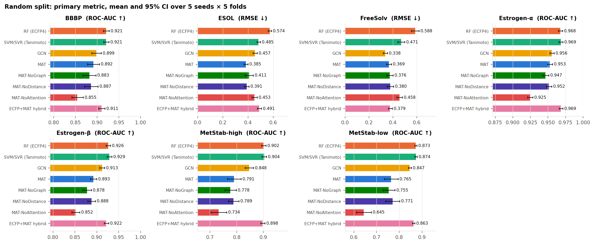

| Model | BBBP (ROC-AUC↑) | ESOL (RMSE↓) | FreeSolv (RMSE↓) | Estrogen-α (ROC-AUC↑) | Estrogen-β (ROC-AUC↑) | MetStab-high (ROC-AUC↑) | MetStab-low (ROC-AUC↑) |
|---|---|---|---|---|---|---|---|
| RF (ECFP4) | 0.921 ± 0.007 | 0.574 ± 0.015 | 0.588 ± 0.032 | 0.968 ± 0.003 | 0.926 ± 0.005 | 0.902 ± 0.008 | 0.873 ± 0.005 |
| SVM/SVR (Tanimoto) | 0.921 ± 0.006 | 0.485 ± 0.014 | 0.471 ± 0.030 | 0.969 ± 0.003 | 0.929 ± 0.006 | 0.904 ± 0.009 | 0.874 ± 0.005 |
| GCN | 0.899 ± 0.011 | 0.457 ± 0.017 | 0.338 ± 0.018 | 0.956 ± 0.003 | 0.913 ± 0.006 | 0.848 ± 0.016 | 0.847 ± 0.006 |
| MAT | 0.892 ± 0.014 | 0.385 ± 0.016 | 0.369 ± 0.021 | 0.953 ± 0.003 | 0.893 ± 0.007 | 0.791 ± 0.025 | 0.765 ± 0.030 |
| MAT-NoGraph | 0.883 ± 0.015 | 0.411 ± 0.033 | 0.376 ± 0.026 | 0.947 ± 0.004 | 0.878 ± 0.010 | 0.778 ± 0.022 | 0.755 ± 0.026 |
| MAT-NoDistance | 0.887 ± 0.016 | 0.391 ± 0.017 | 0.380 ± 0.026 | 0.952 ± 0.004 | 0.888 ± 0.009 | 0.789 ± 0.020 | 0.771 ± 0.031 |
| MAT-NoAttention | 0.855 ± 0.013 | 0.453 ± 0.020 | 0.458 ± 0.023 | 0.925 ± 0.004 | 0.852 ± 0.009 | 0.734 ± 0.030 | 0.645 ± 0.033 |
| ECFP+MAT hybrid | 0.911 ± 0.007 | 0.491 ± 0.018 | 0.379 ± 0.017 | 0.969 ± 0.003 | 0.922 ± 0.005 | 0.898 ± 0.008 | 0.863 ± 0.005 |

Average rank across the 7 tasks (1 = best): SVM/SVR (Tanimoto) 2.86, ECFP+MAT hybrid 3.43, GCN 3.71, RF (ECFP4) 3.71, MAT 4.14, MAT-NoDistance 5.14, MAT-NoGraph 5.86, MAT-NoAttention 7.14.

### 3.2 Scaffold split, primary metric (mean ± 95 % CI over 25 folds)

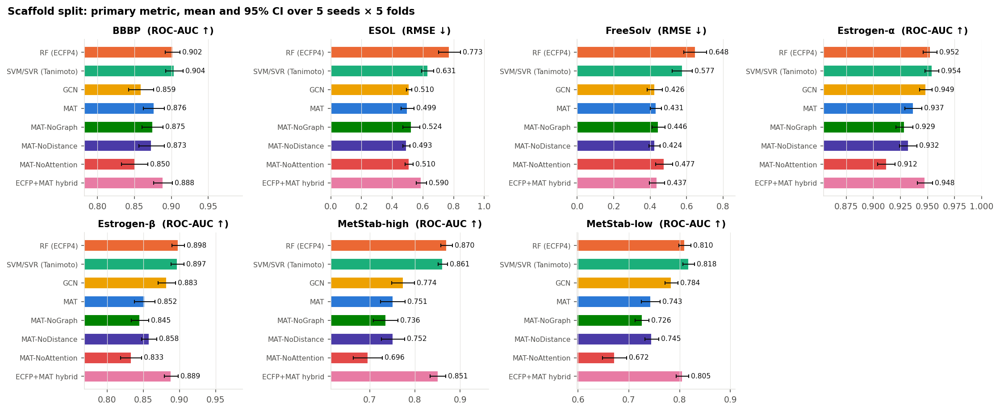

| Model | BBBP (ROC-AUC↑) | ESOL (RMSE↓) | FreeSolv (RMSE↓) | Estrogen-α (ROC-AUC↑) | Estrogen-β (ROC-AUC↑) | MetStab-high (ROC-AUC↑) | MetStab-low (ROC-AUC↑) |
|---|---|---|---|---|---|---|---|
| RF (ECFP4) | 0.902 ± 0.010 | 0.773 ± 0.071 | 0.648 ± 0.062 | 0.952 ± 0.007 | 0.898 ± 0.009 | 0.870 ± 0.013 | 0.810 ± 0.012 |
| SVM/SVR (Tanimoto) | 0.904 ± 0.012 | 0.631 ± 0.040 | 0.577 ± 0.056 | 0.954 ± 0.006 | 0.897 ± 0.009 | 0.861 ± 0.010 | 0.818 ± 0.012 |
| GCN | 0.859 ± 0.017 | 0.510 ± 0.017 | 0.426 ± 0.042 | 0.949 ± 0.006 | 0.883 ± 0.012 | 0.774 ± 0.025 | 0.784 ± 0.013 |
| MAT | 0.876 ± 0.014 | 0.499 ± 0.043 | 0.431 ± 0.031 | 0.937 ± 0.008 | 0.852 ± 0.014 | 0.751 ± 0.027 | 0.743 ± 0.018 |
| MAT-NoGraph | 0.875 ± 0.014 | 0.524 ± 0.055 | 0.446 ± 0.036 | 0.929 ± 0.008 | 0.845 ± 0.012 | 0.736 ± 0.027 | 0.726 ± 0.013 |
| MAT-NoDistance | 0.873 ± 0.017 | 0.493 ± 0.023 | 0.424 ± 0.032 | 0.932 ± 0.008 | 0.858 ± 0.010 | 0.752 ± 0.025 | 0.745 ± 0.013 |
| MAT-NoAttention | 0.850 ± 0.018 | 0.510 ± 0.027 | 0.477 ± 0.046 | 0.912 ± 0.008 | 0.833 ± 0.014 | 0.696 ± 0.032 | 0.672 ± 0.024 |
| ECFP+MAT hybrid | 0.888 ± 0.013 | 0.590 ± 0.034 | 0.437 ± 0.041 | 0.948 ± 0.007 | 0.889 ± 0.009 | 0.851 ± 0.017 | 0.805 ± 0.012 |

Average rank across the 7 tasks (1 = best): SVM/SVR (Tanimoto) 3.00, RF (ECFP4) 3.43, ECFP+MAT hybrid 3.71, GCN 4.00, MAT-NoDistance 4.14, MAT 4.57, MAT-NoGraph 6.14, MAT-NoAttention 7.00.

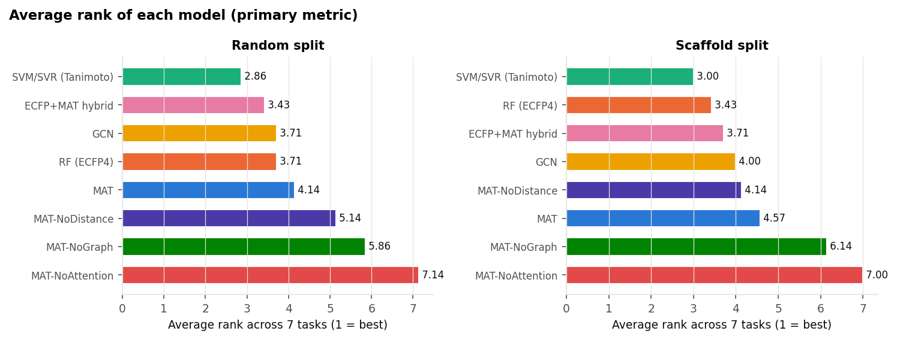

Regression metrics converted to original units (RMSE and MAE scale linearly with the recovered factor):

| Task | Split | Model | RMSE (original units) | 95 % CI |
|---|---|---|---|---|
| ESOL | random | GCN | 0.958 log10(mol/L) | [0.923, 0.993] |
| ESOL | random | ECFP+MAT hybrid | 1.029 log10(mol/L) | [0.993, 1.066] |
| ESOL | random | MAT | 0.808 log10(mol/L) | [0.775, 0.841] |
| ESOL | random | MAT-NoAttention | 0.949 log10(mol/L) | [0.907, 0.992] |
| ESOL | random | MAT-NoDistance | 0.819 log10(mol/L) | [0.783, 0.856] |
| ESOL | random | MAT-NoGraph | 0.861 log10(mol/L) | [0.792, 0.929] |
| ESOL | random | RF (ECFP4) | 1.203 log10(mol/L) | [1.173, 1.234] |
| ESOL | random | SVM/SVR (Tanimoto) | 1.017 log10(mol/L) | [0.988, 1.046] |
| ESOL | scaffold | GCN | 1.069 log10(mol/L) | [1.033, 1.106] |
| ESOL | scaffold | ECFP+MAT hybrid | 1.235 log10(mol/L) | [1.165, 1.306] |
| ESOL | scaffold | MAT | 1.047 log10(mol/L) | [0.957, 1.136] |
| ESOL | scaffold | MAT-NoAttention | 1.069 log10(mol/L) | [1.012, 1.127] |
| ESOL | scaffold | MAT-NoDistance | 1.033 log10(mol/L) | [0.986, 1.081] |
| ESOL | scaffold | MAT-NoGraph | 1.098 log10(mol/L) | [0.982, 1.215] |
| ESOL | scaffold | RF (ECFP4) | 1.619 log10(mol/L) | [1.470, 1.768] |
| ESOL | scaffold | SVM/SVR (Tanimoto) | 1.323 log10(mol/L) | [1.240, 1.407] |
| FreeSolv | random | GCN | 1.301 kcal/mol | [1.231, 1.371] |
| FreeSolv | random | ECFP+MAT hybrid | 1.456 kcal/mol | [1.390, 1.522] |
| FreeSolv | random | MAT | 1.417 kcal/mol | [1.337, 1.498] |
| FreeSolv | random | MAT-NoAttention | 1.760 kcal/mol | [1.670, 1.849] |
| FreeSolv | random | MAT-NoDistance | 1.461 kcal/mol | [1.360, 1.562] |
| FreeSolv | random | MAT-NoGraph | 1.445 kcal/mol | [1.345, 1.546] |
| FreeSolv | random | RF (ECFP4) | 2.262 kcal/mol | [2.138, 2.387] |
| FreeSolv | random | SVM/SVR (Tanimoto) | 1.812 kcal/mol | [1.698, 1.927] |
| FreeSolv | scaffold | GCN | 1.639 kcal/mol | [1.479, 1.799] |
| FreeSolv | scaffold | ECFP+MAT hybrid | 1.682 kcal/mol | [1.524, 1.840] |
| FreeSolv | scaffold | MAT | 1.659 kcal/mol | [1.539, 1.779] |
| FreeSolv | scaffold | MAT-NoAttention | 1.833 kcal/mol | [1.656, 2.011] |
| FreeSolv | scaffold | MAT-NoDistance | 1.631 kcal/mol | [1.509, 1.752] |
| FreeSolv | scaffold | MAT-NoGraph | 1.713 kcal/mol | [1.576, 1.850] |
| FreeSolv | scaffold | RF (ECFP4) | 2.491 kcal/mol | [2.252, 2.731] |
| FreeSolv | scaffold | SVM/SVR (Tanimoto) | 2.217 kcal/mol | [2.004, 2.431] |

## 4. Statistical comparison against MAT

Difference = model − MAT on the primary metric over the 25 paired folds. `t` = paired t-test p-value, `W` = Wilcoxon signed-rank p-value, `Holm` = Holm-adjusted Wilcoxon p within the (task, split) family; stars: * p<0.05, ** p<0.01, *** p<0.001 (Wilcoxon). Positive differences favour the model for ROC-AUC and negative differences favour the model for RMSE. Seed-level column: Wilcoxon p on the 5 seed means.

### 4.1 Random split

| Task | Model | Metric | Δ (model − MAT) | 95 % CI of Δ | t p | W p | Holm p | seed-level W p | Better |
|---|---|---|---|---|---|---|---|---|---|
| BBBP | RF (ECFP4) | ROC-AUC | 0.030 | [0.017, 0.042] | <0.001 | <0.001*** | <0.001 | 0.062 | RF (ECFP4) |
| BBBP | SVM/SVR (Tanimoto) | ROC-AUC | 0.029 | [0.017, 0.042] | <0.001 | <0.001*** | <0.001 | 0.062 | SVM/SVR (Tanimoto) |
| BBBP | GCN | ROC-AUC | 0.007 | [-0.007, 0.021] | 0.309 | 0.381 | 0.762 | 0.625 | GCN |
| BBBP | MAT-NoGraph | ROC-AUC | -0.009 | [-0.017, -0.002] | 0.018 | 0.027* | 0.082 | 0.125 | MAT |
| BBBP | MAT-NoDistance | ROC-AUC | -0.005 | [-0.015, 0.005] | 0.287 | 0.475 | 0.762 | 0.312 | MAT |
| BBBP | MAT-NoAttention | ROC-AUC | -0.037 | [-0.048, -0.026] | <0.001 | <0.001*** | <0.001 | 0.062 | MAT |
| BBBP | ECFP+MAT hybrid | ROC-AUC | 0.019 | [0.007, 0.031] | 0.003 | 0.001** | 0.005 | 0.062 | ECFP+MAT hybrid |
| ESOL | RF (ECFP4) | RMSE | 0.189 | [0.173, 0.205] | <0.001 | <0.001*** | <0.001 | 0.062 | MAT |
| ESOL | SVM/SVR (Tanimoto) | RMSE | 0.100 | [0.087, 0.113] | <0.001 | <0.001*** | <0.001 | 0.062 | MAT |
| ESOL | GCN | RMSE | 0.072 | [0.058, 0.086] | <0.001 | <0.001*** | <0.001 | 0.062 | MAT |
| ESOL | MAT-NoGraph | RMSE | 0.025 | [-0.003, 0.054] | 0.079 | 0.090 | 0.181 | 0.062 | MAT |
| ESOL | MAT-NoDistance | RMSE | 0.006 | [-0.013, 0.024] | 0.538 | 0.653 | 0.653 | 0.625 | MAT |
| ESOL | MAT-NoAttention | RMSE | 0.068 | [0.047, 0.088] | <0.001 | <0.001*** | <0.001 | 0.062 | MAT |
| ESOL | ECFP+MAT hybrid | RMSE | 0.106 | [0.086, 0.126] | <0.001 | <0.001*** | <0.001 | 0.062 | MAT |
| FreeSolv | RF (ECFP4) | RMSE | 0.220 | [0.191, 0.248] | <0.001 | <0.001*** | <0.001 | 0.062 | MAT |
| FreeSolv | SVM/SVR (Tanimoto) | RMSE | 0.103 | [0.076, 0.130] | <0.001 | <0.001*** | <0.001 | 0.062 | MAT |
| FreeSolv | GCN | RMSE | -0.030 | [-0.056, -0.004] | 0.023 | 0.045* | 0.180 | 0.125 | GCN |
| FreeSolv | MAT-NoGraph | RMSE | 0.007 | [-0.011, 0.026] | 0.410 | 0.812 | 0.916 | 0.438 | MAT |
| FreeSolv | MAT-NoDistance | RMSE | 0.011 | [-0.007, 0.030] | 0.216 | 0.458 | 0.916 | 0.188 | MAT |
| FreeSolv | MAT-NoAttention | RMSE | 0.089 | [0.060, 0.119] | <0.001 | <0.001*** | <0.001 | 0.062 | MAT |
| FreeSolv | ECFP+MAT hybrid | RMSE | 0.010 | [-0.011, 0.031] | 0.326 | 0.220 | 0.660 | 0.812 | MAT |
| Estrogen-α | RF (ECFP4) | ROC-AUC | 0.015 | [0.012, 0.018] | <0.001 | <0.001*** | <0.001 | 0.062 | RF (ECFP4) |
| Estrogen-α | SVM/SVR (Tanimoto) | ROC-AUC | 0.016 | [0.012, 0.019] | <0.001 | <0.001*** | <0.001 | 0.062 | SVM/SVR (Tanimoto) |
| Estrogen-α | GCN | ROC-AUC | 0.003 | [-0.000, 0.006] | 0.078 | 0.071 | 0.143 | 0.125 | GCN |
| Estrogen-α | MAT-NoGraph | ROC-AUC | -0.006 | [-0.009, -0.003] | <0.001 | <0.001*** | <0.001 | 0.062 | MAT |
| Estrogen-α | MAT-NoDistance | ROC-AUC | -0.001 | [-0.004, 0.001] | 0.233 | 0.210 | 0.210 | 0.625 | MAT |
| Estrogen-α | MAT-NoAttention | ROC-AUC | -0.028 | [-0.032, -0.024] | <0.001 | <0.001*** | <0.001 | 0.062 | MAT |
| Estrogen-α | ECFP+MAT hybrid | ROC-AUC | 0.016 | [0.013, 0.018] | <0.001 | <0.001*** | <0.001 | 0.062 | ECFP+MAT hybrid |
| Estrogen-β | RF (ECFP4) | ROC-AUC | 0.034 | [0.028, 0.039] | <0.001 | <0.001*** | <0.001 | 0.062 | RF (ECFP4) |
| Estrogen-β | SVM/SVR (Tanimoto) | ROC-AUC | 0.036 | [0.030, 0.043] | <0.001 | <0.001*** | <0.001 | 0.062 | SVM/SVR (Tanimoto) |
| Estrogen-β | GCN | ROC-AUC | 0.020 | [0.014, 0.026] | <0.001 | <0.001*** | <0.001 | 0.062 | GCN |
| Estrogen-β | MAT-NoGraph | ROC-AUC | -0.015 | [-0.020, -0.009] | <0.001 | <0.001*** | <0.001 | 0.062 | MAT |
| Estrogen-β | MAT-NoDistance | ROC-AUC | -0.005 | [-0.011, 0.001] | 0.123 | 0.090 | 0.090 | 0.312 | MAT |
| Estrogen-β | MAT-NoAttention | ROC-AUC | -0.041 | [-0.048, -0.034] | <0.001 | <0.001*** | <0.001 | 0.062 | MAT |
| Estrogen-β | ECFP+MAT hybrid | ROC-AUC | 0.029 | [0.023, 0.035] | <0.001 | <0.001*** | <0.001 | 0.062 | ECFP+MAT hybrid |
| MetStab-high | RF (ECFP4) | ROC-AUC | 0.111 | [0.084, 0.137] | <0.001 | <0.001*** | <0.001 | 0.062 | RF (ECFP4) |
| MetStab-high | SVM/SVR (Tanimoto) | ROC-AUC | 0.113 | [0.086, 0.140] | <0.001 | <0.001*** | <0.001 | 0.062 | SVM/SVR (Tanimoto) |
| MetStab-high | GCN | ROC-AUC | 0.057 | [0.032, 0.081] | <0.001 | <0.001*** | <0.001 | 0.062 | GCN |
| MetStab-high | MAT-NoGraph | ROC-AUC | -0.013 | [-0.035, 0.008] | 0.205 | 0.045* | 0.090 | 0.062 | MAT |
| MetStab-high | MAT-NoDistance | ROC-AUC | -0.002 | [-0.022, 0.017] | 0.819 | 0.300 | 0.300 | 0.812 | MAT |
| MetStab-high | MAT-NoAttention | ROC-AUC | -0.057 | [-0.090, -0.025] | 0.001 | <0.001*** | <0.001 | 0.062 | MAT |
| MetStab-high | ECFP+MAT hybrid | ROC-AUC | 0.107 | [0.084, 0.130] | <0.001 | <0.001*** | <0.001 | 0.062 | ECFP+MAT hybrid |
| MetStab-low | RF (ECFP4) | ROC-AUC | 0.108 | [0.079, 0.138] | <0.001 | <0.001*** | <0.001 | 0.062 | RF (ECFP4) |
| MetStab-low | SVM/SVR (Tanimoto) | ROC-AUC | 0.110 | [0.081, 0.138] | <0.001 | <0.001*** | <0.001 | 0.062 | SVM/SVR (Tanimoto) |
| MetStab-low | GCN | ROC-AUC | 0.082 | [0.053, 0.112] | <0.001 | <0.001*** | <0.001 | 0.062 | GCN |
| MetStab-low | MAT-NoGraph | ROC-AUC | -0.010 | [-0.019, -0.001] | 0.027 | 0.039* | 0.079 | 0.062 | MAT |
| MetStab-low | MAT-NoDistance | ROC-AUC | 0.007 | [-0.003, 0.016] | 0.160 | 0.210 | 0.210 | 0.188 | MAT-NoDistance |
| MetStab-low | MAT-NoAttention | ROC-AUC | -0.120 | [-0.155, -0.086] | <0.001 | <0.001*** | <0.001 | 0.062 | MAT |
| MetStab-low | ECFP+MAT hybrid | ROC-AUC | 0.099 | [0.070, 0.128] | <0.001 | <0.001*** | <0.001 | 0.062 | ECFP+MAT hybrid |

- RF (ECFP4) vs MAT (random): MAT significantly better on 2/7 tasks, RF (ECFP4) significantly better on 5/7 tasks (Wilcoxon p < 0.05).
- SVM/SVR (Tanimoto) vs MAT (random): MAT significantly better on 2/7 tasks, SVM/SVR (Tanimoto) significantly better on 5/7 tasks (Wilcoxon p < 0.05).
- GCN vs MAT (random): MAT significantly better on 1/7 tasks, GCN significantly better on 4/7 tasks (Wilcoxon p < 0.05).
- MAT-NoGraph vs MAT (random): MAT significantly better on 5/7 tasks, MAT-NoGraph significantly better on 0/7 tasks (Wilcoxon p < 0.05).
- MAT-NoDistance vs MAT (random): MAT significantly better on 0/7 tasks, MAT-NoDistance significantly better on 0/7 tasks (Wilcoxon p < 0.05).
- MAT-NoAttention vs MAT (random): MAT significantly better on 7/7 tasks, MAT-NoAttention significantly better on 0/7 tasks (Wilcoxon p < 0.05).
- ECFP+MAT hybrid vs MAT (random): MAT significantly better on 1/7 tasks, ECFP+MAT hybrid significantly better on 5/7 tasks (Wilcoxon p < 0.05).

### 4.2 Scaffold split

| Task | Model | Metric | Δ (model − MAT) | 95 % CI of Δ | t p | W p | Holm p | seed-level W p | Better |
|---|---|---|---|---|---|---|---|---|---|
| BBBP | RF (ECFP4) | ROC-AUC | 0.025 | [0.015, 0.036] | <0.001 | <0.001*** | <0.001 | 0.062 | RF (ECFP4) |
| BBBP | SVM/SVR (Tanimoto) | ROC-AUC | 0.028 | [0.018, 0.037] | <0.001 | <0.001*** | <0.001 | 0.062 | SVM/SVR (Tanimoto) |
| BBBP | GCN | ROC-AUC | -0.017 | [-0.028, -0.006] | 0.003 | 0.002** | 0.008 | 0.062 | MAT |
| BBBP | MAT-NoGraph | ROC-AUC | -0.002 | [-0.009, 0.005] | 0.590 | 0.751 | 1.000 | 0.625 | MAT |
| BBBP | MAT-NoDistance | ROC-AUC | -0.003 | [-0.011, 0.005] | 0.406 | 0.731 | 1.000 | 0.438 | MAT |
| BBBP | MAT-NoAttention | ROC-AUC | -0.026 | [-0.037, -0.015] | <0.001 | <0.001*** | <0.001 | 0.062 | MAT |
| BBBP | ECFP+MAT hybrid | ROC-AUC | 0.012 | [-0.001, 0.025] | 0.076 | 0.055 | 0.165 | 0.062 | ECFP+MAT hybrid |
| ESOL | RF (ECFP4) | RMSE | 0.273 | [0.227, 0.319] | <0.001 | <0.001*** | <0.001 | 0.062 | MAT |
| ESOL | SVM/SVR (Tanimoto) | RMSE | 0.132 | [0.103, 0.161] | <0.001 | <0.001*** | <0.001 | 0.062 | MAT |
| ESOL | GCN | RMSE | 0.011 | [-0.032, 0.054] | 0.603 | 0.164 | 0.658 | 0.312 | MAT |
| ESOL | MAT-NoGraph | RMSE | 0.025 | [-0.011, 0.061] | 0.168 | 0.263 | 0.790 | 0.438 | MAT |
| ESOL | MAT-NoDistance | RMSE | -0.006 | [-0.041, 0.029] | 0.717 | 0.916 | 0.982 | 0.812 | MAT-NoDistance |
| ESOL | MAT-NoAttention | RMSE | 0.011 | [-0.034, 0.055] | 0.617 | 0.491 | 0.982 | 0.438 | MAT |
| ESOL | ECFP+MAT hybrid | RMSE | 0.090 | [0.057, 0.124] | <0.001 | <0.001*** | <0.001 | 0.062 | MAT |
| FreeSolv | RF (ECFP4) | RMSE | 0.216 | [0.157, 0.276] | <0.001 | <0.001*** | <0.001 | 0.062 | MAT |
| FreeSolv | SVM/SVR (Tanimoto) | RMSE | 0.145 | [0.097, 0.193] | <0.001 | <0.001*** | <0.001 | 0.062 | MAT |
| FreeSolv | GCN | RMSE | -0.005 | [-0.040, 0.030] | 0.758 | 0.491 | 0.982 | 1.000 | GCN |
| FreeSolv | MAT-NoGraph | RMSE | 0.014 | [-0.005, 0.033] | 0.136 | 0.071 | 0.355 | 0.312 | MAT |
| FreeSolv | MAT-NoDistance | RMSE | -0.007 | [-0.022, 0.007] | 0.302 | 0.287 | 0.862 | 0.438 | MAT-NoDistance |
| FreeSolv | MAT-NoAttention | RMSE | 0.045 | [-0.007, 0.097] | 0.084 | 0.113 | 0.454 | 0.125 | MAT |
| FreeSolv | ECFP+MAT hybrid | RMSE | 0.006 | [-0.027, 0.039] | 0.709 | 0.791 | 0.982 | 0.625 | MAT |
| Estrogen-α | RF (ECFP4) | ROC-AUC | 0.016 | [0.010, 0.021] | <0.001 | <0.001*** | <0.001 | 0.062 | RF (ECFP4) |
| Estrogen-α | SVM/SVR (Tanimoto) | ROC-AUC | 0.017 | [0.012, 0.023] | <0.001 | <0.001*** | <0.001 | 0.062 | SVM/SVR (Tanimoto) |
| Estrogen-α | GCN | ROC-AUC | 0.012 | [0.007, 0.016] | <0.001 | <0.001*** | <0.001 | 0.062 | GCN |
| Estrogen-α | MAT-NoGraph | ROC-AUC | -0.008 | [-0.012, -0.004] | <0.001 | <0.001*** | 0.001 | 0.062 | MAT |
| Estrogen-α | MAT-NoDistance | ROC-AUC | -0.005 | [-0.010, 0.000] | 0.066 | 0.075 | 0.075 | 0.062 | MAT |
| Estrogen-α | MAT-NoAttention | ROC-AUC | -0.025 | [-0.031, -0.019] | <0.001 | <0.001*** | <0.001 | 0.062 | MAT |
| Estrogen-α | ECFP+MAT hybrid | ROC-AUC | 0.011 | [0.005, 0.017] | <0.001 | <0.001*** | 0.001 | 0.125 | ECFP+MAT hybrid |
| Estrogen-β | RF (ECFP4) | ROC-AUC | 0.046 | [0.035, 0.057] | <0.001 | <0.001*** | <0.001 | 0.062 | RF (ECFP4) |
| Estrogen-β | SVM/SVR (Tanimoto) | ROC-AUC | 0.045 | [0.034, 0.056] | <0.001 | <0.001*** | <0.001 | 0.062 | SVM/SVR (Tanimoto) |
| Estrogen-β | GCN | ROC-AUC | 0.030 | [0.018, 0.043] | <0.001 | <0.001*** | <0.001 | 0.062 | GCN |
| Estrogen-β | MAT-NoGraph | ROC-AUC | -0.007 | [-0.017, 0.004] | 0.206 | 0.252 | 0.504 | 0.438 | MAT |
| Estrogen-β | MAT-NoDistance | ROC-AUC | 0.006 | [-0.004, 0.016] | 0.203 | 0.312 | 0.504 | 0.625 | MAT-NoDistance |
| Estrogen-β | MAT-NoAttention | ROC-AUC | -0.019 | [-0.033, -0.005] | 0.011 | 0.010** | 0.029 | 0.125 | MAT |
| Estrogen-β | ECFP+MAT hybrid | ROC-AUC | 0.037 | [0.025, 0.048] | <0.001 | <0.001*** | <0.001 | 0.062 | ECFP+MAT hybrid |
| MetStab-high | RF (ECFP4) | ROC-AUC | 0.119 | [0.089, 0.148] | <0.001 | <0.001*** | <0.001 | 0.062 | RF (ECFP4) |
| MetStab-high | SVM/SVR (Tanimoto) | ROC-AUC | 0.110 | [0.080, 0.140] | <0.001 | <0.001*** | <0.001 | 0.062 | SVM/SVR (Tanimoto) |
| MetStab-high | GCN | ROC-AUC | 0.023 | [-0.013, 0.058] | 0.205 | 0.059 | 0.118 | 0.312 | GCN |
| MetStab-high | MAT-NoGraph | ROC-AUC | -0.016 | [-0.030, -0.002] | 0.025 | 0.016* | 0.048 | 0.062 | MAT |
| MetStab-high | MAT-NoDistance | ROC-AUC | 0.000 | [-0.013, 0.013] | 0.975 | 0.812 | 0.812 | 1.000 | MAT-NoDistance |
| MetStab-high | MAT-NoAttention | ROC-AUC | -0.055 | [-0.085, -0.025] | <0.001 | <0.001*** | 0.003 | 0.062 | MAT |
| MetStab-high | ECFP+MAT hybrid | ROC-AUC | 0.099 | [0.070, 0.128] | <0.001 | <0.001*** | <0.001 | 0.062 | ECFP+MAT hybrid |
| MetStab-low | RF (ECFP4) | ROC-AUC | 0.067 | [0.054, 0.080] | <0.001 | <0.001*** | <0.001 | 0.062 | RF (ECFP4) |
| MetStab-low | SVM/SVR (Tanimoto) | ROC-AUC | 0.075 | [0.060, 0.089] | <0.001 | <0.001*** | <0.001 | 0.062 | SVM/SVR (Tanimoto) |
| MetStab-low | GCN | ROC-AUC | 0.041 | [0.022, 0.060] | <0.001 | <0.001*** | 0.002 | 0.062 | GCN |
| MetStab-low | MAT-NoGraph | ROC-AUC | -0.017 | [-0.034, -0.000] | 0.044 | 0.048* | 0.097 | 0.188 | MAT |
| MetStab-low | MAT-NoDistance | ROC-AUC | 0.002 | [-0.011, 0.015] | 0.745 | 0.615 | 0.615 | 0.812 | MAT-NoDistance |
| MetStab-low | MAT-NoAttention | ROC-AUC | -0.071 | [-0.093, -0.049] | <0.001 | <0.001*** | <0.001 | 0.062 | MAT |
| MetStab-low | ECFP+MAT hybrid | ROC-AUC | 0.062 | [0.046, 0.078] | <0.001 | <0.001*** | <0.001 | 0.062 | ECFP+MAT hybrid |

- RF (ECFP4) vs MAT (scaffold): MAT significantly better on 2/7 tasks, RF (ECFP4) significantly better on 5/7 tasks (Wilcoxon p < 0.05).
- SVM/SVR (Tanimoto) vs MAT (scaffold): MAT significantly better on 2/7 tasks, SVM/SVR (Tanimoto) significantly better on 5/7 tasks (Wilcoxon p < 0.05).
- GCN vs MAT (scaffold): MAT significantly better on 1/7 tasks, GCN significantly better on 3/7 tasks (Wilcoxon p < 0.05).
- MAT-NoGraph vs MAT (scaffold): MAT significantly better on 3/7 tasks, MAT-NoGraph significantly better on 0/7 tasks (Wilcoxon p < 0.05).
- MAT-NoDistance vs MAT (scaffold): MAT significantly better on 0/7 tasks, MAT-NoDistance significantly better on 0/7 tasks (Wilcoxon p < 0.05).
- MAT-NoAttention vs MAT (scaffold): MAT significantly better on 5/7 tasks, MAT-NoAttention significantly better on 0/7 tasks (Wilcoxon p < 0.05).
- ECFP+MAT hybrid vs MAT (scaffold): MAT significantly better on 1/7 tasks, ECFP+MAT hybrid significantly better on 4/7 tasks (Wilcoxon p < 0.05).

## 5. Ablation study: contribution of each MAT term

Contribution = MAT − ablation on the primary metric (paired, 25 folds). For ROC-AUC a positive value means the term helps; for RMSE a negative value means the term helps (lower error). Removing a term re-distributes its λ weight equally to the remaining two terms.

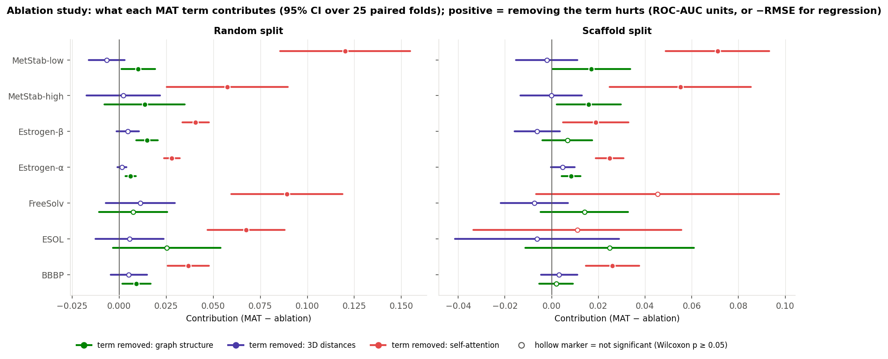

| Split | Task | Term removed | Metric | Contribution | 95 % CI | t p | W p | seed-level W p | Verdict |
|---|---|---|---|---|---|---|---|---|---|
| random | BBBP | graph structure | ROC-AUC | 0.009 | [0.002, 0.017] | 0.018 | 0.027* | 0.125 | helps (sig.) |
| random | BBBP | 3D distances | ROC-AUC | 0.005 | [-0.005, 0.015] | 0.287 | 0.475 | 0.312 | helps (n.s.) |
| random | BBBP | self-attention | ROC-AUC | 0.037 | [0.026, 0.048] | <0.001 | <0.001*** | 0.062 | helps (sig.) |
| random | ESOL | graph structure | RMSE | -0.025 | [-0.054, 0.003] | 0.079 | 0.090 | 0.062 | helps (n.s.) |
| random | ESOL | 3D distances | RMSE | -0.006 | [-0.024, 0.013] | 0.538 | 0.653 | 0.625 | helps (n.s.) |
| random | ESOL | self-attention | RMSE | -0.068 | [-0.088, -0.047] | <0.001 | <0.001*** | 0.062 | helps (sig.) |
| random | FreeSolv | graph structure | RMSE | -0.007 | [-0.026, 0.011] | 0.410 | 0.812 | 0.438 | helps (n.s.) |
| random | FreeSolv | 3D distances | RMSE | -0.011 | [-0.030, 0.007] | 0.216 | 0.458 | 0.188 | helps (n.s.) |
| random | FreeSolv | self-attention | RMSE | -0.089 | [-0.119, -0.060] | <0.001 | <0.001*** | 0.062 | helps (sig.) |
| random | Estrogen-α | graph structure | ROC-AUC | 0.006 | [0.003, 0.009] | <0.001 | <0.001*** | 0.062 | helps (sig.) |
| random | Estrogen-α | 3D distances | ROC-AUC | 0.001 | [-0.001, 0.004] | 0.233 | 0.210 | 0.625 | helps (n.s.) |
| random | Estrogen-α | self-attention | ROC-AUC | 0.028 | [0.024, 0.032] | <0.001 | <0.001*** | 0.062 | helps (sig.) |
| random | Estrogen-β | graph structure | ROC-AUC | 0.015 | [0.009, 0.020] | <0.001 | <0.001*** | 0.062 | helps (sig.) |
| random | Estrogen-β | 3D distances | ROC-AUC | 0.005 | [-0.001, 0.011] | 0.123 | 0.090 | 0.312 | helps (n.s.) |
| random | Estrogen-β | self-attention | ROC-AUC | 0.041 | [0.034, 0.048] | <0.001 | <0.001*** | 0.062 | helps (sig.) |
| random | MetStab-high | graph structure | ROC-AUC | 0.013 | [-0.008, 0.035] | 0.205 | 0.045* | 0.062 | helps (sig.) |
| random | MetStab-high | 3D distances | ROC-AUC | 0.002 | [-0.017, 0.022] | 0.819 | 0.300 | 0.812 | helps (n.s.) |
| random | MetStab-high | self-attention | ROC-AUC | 0.057 | [0.025, 0.090] | 0.001 | <0.001*** | 0.062 | helps (sig.) |
| random | MetStab-low | graph structure | ROC-AUC | 0.010 | [0.001, 0.019] | 0.027 | 0.039* | 0.062 | helps (sig.) |
| random | MetStab-low | 3D distances | ROC-AUC | -0.007 | [-0.016, 0.003] | 0.160 | 0.210 | 0.188 | hurts (n.s.) |
| random | MetStab-low | self-attention | ROC-AUC | 0.120 | [0.086, 0.155] | <0.001 | <0.001*** | 0.062 | helps (sig.) |
| scaffold | BBBP | graph structure | ROC-AUC | 0.002 | [-0.005, 0.009] | 0.590 | 0.751 | 0.625 | helps (n.s.) |
| scaffold | BBBP | 3D distances | ROC-AUC | 0.003 | [-0.005, 0.011] | 0.406 | 0.731 | 0.438 | helps (n.s.) |
| scaffold | BBBP | self-attention | ROC-AUC | 0.026 | [0.015, 0.037] | <0.001 | <0.001*** | 0.062 | helps (sig.) |
| scaffold | ESOL | graph structure | RMSE | -0.025 | [-0.061, 0.011] | 0.168 | 0.263 | 0.438 | helps (n.s.) |
| scaffold | ESOL | 3D distances | RMSE | 0.006 | [-0.029, 0.041] | 0.717 | 0.916 | 0.812 | hurts (n.s.) |
| scaffold | ESOL | self-attention | RMSE | -0.011 | [-0.055, 0.034] | 0.617 | 0.491 | 0.438 | helps (n.s.) |
| scaffold | FreeSolv | graph structure | RMSE | -0.014 | [-0.033, 0.005] | 0.136 | 0.071 | 0.312 | helps (n.s.) |
| scaffold | FreeSolv | 3D distances | RMSE | 0.007 | [-0.007, 0.022] | 0.302 | 0.287 | 0.438 | hurts (n.s.) |
| scaffold | FreeSolv | self-attention | RMSE | -0.045 | [-0.097, 0.007] | 0.084 | 0.113 | 0.125 | helps (n.s.) |
| scaffold | Estrogen-α | graph structure | ROC-AUC | 0.008 | [0.004, 0.012] | <0.001 | <0.001*** | 0.062 | helps (sig.) |
| scaffold | Estrogen-α | 3D distances | ROC-AUC | 0.005 | [-0.000, 0.010] | 0.066 | 0.075 | 0.062 | helps (n.s.) |
| scaffold | Estrogen-α | self-attention | ROC-AUC | 0.025 | [0.019, 0.031] | <0.001 | <0.001*** | 0.062 | helps (sig.) |
| scaffold | Estrogen-β | graph structure | ROC-AUC | 0.007 | [-0.004, 0.017] | 0.206 | 0.252 | 0.438 | helps (n.s.) |
| scaffold | Estrogen-β | 3D distances | ROC-AUC | -0.006 | [-0.016, 0.004] | 0.203 | 0.312 | 0.625 | hurts (n.s.) |
| scaffold | Estrogen-β | self-attention | ROC-AUC | 0.019 | [0.005, 0.033] | 0.011 | 0.010** | 0.125 | helps (sig.) |
| scaffold | MetStab-high | graph structure | ROC-AUC | 0.016 | [0.002, 0.030] | 0.025 | 0.016* | 0.062 | helps (sig.) |
| scaffold | MetStab-high | 3D distances | ROC-AUC | -0.000 | [-0.013, 0.013] | 0.975 | 0.812 | 1.000 | hurts (n.s.) |
| scaffold | MetStab-high | self-attention | ROC-AUC | 0.055 | [0.025, 0.085] | <0.001 | <0.001*** | 0.062 | helps (sig.) |
| scaffold | MetStab-low | graph structure | ROC-AUC | 0.017 | [0.000, 0.034] | 0.044 | 0.048* | 0.188 | helps (sig.) |
| scaffold | MetStab-low | 3D distances | ROC-AUC | -0.002 | [-0.015, 0.011] | 0.745 | 0.615 | 0.812 | hurts (n.s.) |
| scaffold | MetStab-low | self-attention | ROC-AUC | 0.071 | [0.049, 0.093] | <0.001 | <0.001*** | 0.062 | helps (sig.) |

- graph structure (random): helps significantly on 5/7 tasks, hurts significantly on 0/7 tasks, point estimate helps on 7/7.
- graph structure (scaffold): helps significantly on 3/7 tasks, hurts significantly on 0/7 tasks, point estimate helps on 7/7.
- 3D distances (random): helps significantly on 0/7 tasks, hurts significantly on 0/7 tasks, point estimate helps on 6/7.
- 3D distances (scaffold): helps significantly on 0/7 tasks, hurts significantly on 0/7 tasks, point estimate helps on 2/7.
- self-attention (random): helps significantly on 7/7 tasks, hurts significantly on 0/7 tasks, point estimate helps on 7/7.
- self-attention (scaffold): helps significantly on 5/7 tasks, hurts significantly on 0/7 tasks, point estimate helps on 7/7.

## 6. Generalization gap (random − scaffold)

Gap = mean random-split score − mean scaffold-split score on the primary metric (Welch 95 % CI; the two split types are independent partitions). A positive ROC-AUC gap or a negative RMSE gap means the model performs worse on unseen scaffolds.

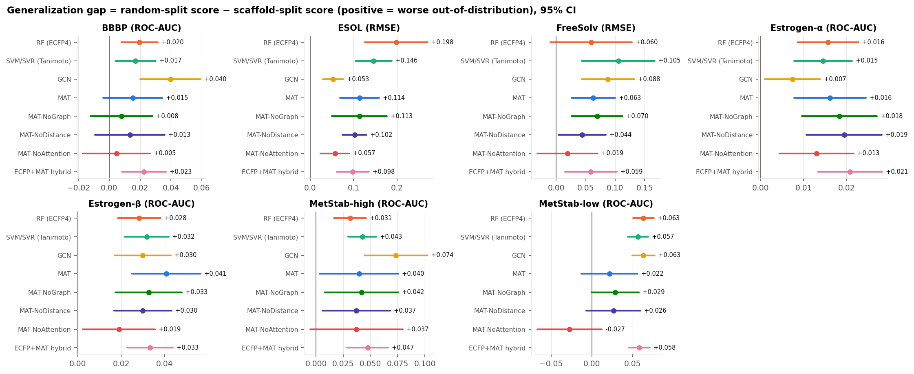

| Model | BBBP (ROC-AUC) | ESOL (RMSE) | FreeSolv (RMSE) | Estrogen-α (ROC-AUC) | Estrogen-β (ROC-AUC) | MetStab-high (ROC-AUC) | MetStab-low (ROC-AUC) |
|---|---|---|---|---|---|---|---|
| RF (ECFP4) | 0.020 [0.008, 0.032] | -0.198 [-0.271, -0.126] | -0.060 [-0.129, 0.009] | 0.016 [0.009, 0.023] | 0.028 [0.018, 0.038] | 0.031 [0.017, 0.046] | 0.063 [0.050, 0.076] |
| SVM/SVR (Tanimoto) | 0.017 [0.004, 0.030] | -0.146 [-0.188, -0.104] | -0.105 [-0.167, -0.043] | 0.015 [0.008, 0.021] | 0.032 [0.022, 0.042] | 0.043 [0.029, 0.056] | 0.057 [0.044, 0.069] |
| GCN | 0.040 [0.020, 0.059] | -0.053 [-0.077, -0.030] | -0.088 [-0.133, -0.043] | 0.007 [0.001, 0.014] | 0.030 [0.017, 0.043] | 0.074 [0.045, 0.103] | 0.063 [0.049, 0.077] |
| MAT | 0.015 [-0.004, 0.034] | -0.114 [-0.159, -0.069] | -0.063 [-0.100, -0.026] | 0.016 [0.008, 0.025] | 0.041 [0.025, 0.057] | 0.040 [0.003, 0.076] | 0.022 [-0.013, 0.056] |
| MAT-NoGraph | 0.008 [-0.012, 0.028] | -0.113 [-0.176, -0.050] | -0.070 [-0.113, -0.026] | 0.018 [0.010, 0.027] | 0.033 [0.017, 0.048] | 0.042 [0.008, 0.076] | 0.029 [-0.000, 0.058] |
| MAT-NoDistance | 0.013 [-0.009, 0.036] | -0.102 [-0.130, -0.074] | -0.044 [-0.084, -0.004] | 0.019 [0.011, 0.028] | 0.030 [0.017, 0.043] | 0.037 [0.006, 0.068] | 0.026 [-0.007, 0.059] |
| MAT-NoAttention | 0.005 [-0.017, 0.026] | -0.057 [-0.091, -0.024] | -0.019 [-0.070, 0.032] | 0.013 [0.004, 0.022] | 0.019 [0.002, 0.036] | 0.037 [-0.005, 0.080] | -0.027 [-0.067, 0.012] |
| ECFP+MAT hybrid | 0.023 [0.008, 0.037] | -0.098 [-0.136, -0.061] | -0.059 [-0.103, -0.015] | 0.021 [0.013, 0.028] | 0.033 [0.023, 0.044] | 0.047 [0.029, 0.066] | 0.058 [0.045, 0.071] |

Mean ROC-AUC drop from random to scaffold split over the five classification tasks: RF (ECFP4) 0.032, SVM/SVR (Tanimoto) 0.033, GCN 0.043, MAT 0.027, MAT-NoGraph 0.026, MAT-NoDistance 0.025, MAT-NoAttention 0.009, ECFP+MAT hybrid 0.036.

## 7. Pretrained MAT versus scratch MAT (Tier 2, released architecture: 8 layers, d_model 1024, 16 heads, 42 M parameters)

Note on the tests: with n = 5 paired seeds the two-sided Wilcoxon signed-rank test cannot go below p = 0.0625, so it can never reach the 0.05 threshold in this section; the paired t-test is the informative test here.

Protocol: fold 0 of every seed, both split types, 15 epochs maximum with early stopping (patience 5), identical for both variants; 140 runs. The pretrained variant loads the authors' released checkpoint (all encoder weights, the pretraining head is discarded); the scratch variant uses the same architecture with Xavier initialisation.

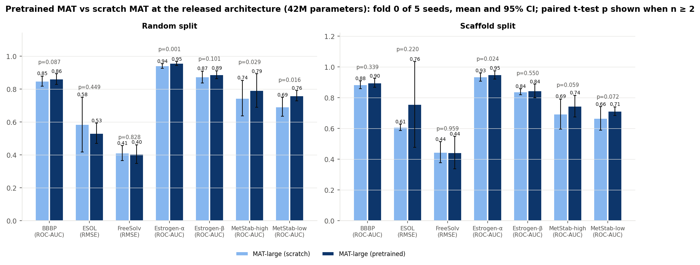

| Split | Task | Metric | Pretrained (n=5) | Scratch-large (n=5) | Small MAT (25 folds) | Δ (pre − scratch) | t p | W p | Better |
|---|---|---|---|---|---|---|---|---|---|
| random | BBBP | ROC-AUC | 0.861 | 0.848 | 0.892 | 0.013 | 0.087 | 0.125 | pretrained |
| random | ESOL | RMSE | 0.531 | 0.584 | 0.385 | -0.053 | 0.449 | 0.625 | pretrained |
| random | FreeSolv | RMSE | 0.404 | 0.409 | 0.369 | -0.006 | 0.828 | 1.000 | pretrained |
| random | Estrogen-α | ROC-AUC | 0.955 | 0.940 | 0.953 | 0.015 | 0.001 | 0.062 | pretrained |
| random | Estrogen-β | ROC-AUC | 0.887 | 0.873 | 0.893 | 0.014 | 0.101 | 0.125 | pretrained |
| random | MetStab-high | ROC-AUC | 0.790 | 0.744 | 0.791 | 0.046 | 0.029 | 0.062 | pretrained |
| random | MetStab-low | ROC-AUC | 0.759 | 0.692 | 0.765 | 0.067 | 0.016 | 0.062 | pretrained |
| scaffold | BBBP | ROC-AUC | 0.895 | 0.882 | 0.876 | 0.013 | 0.339 | 0.438 | pretrained |
| scaffold | ESOL | RMSE | 0.755 | 0.607 | 0.499 | 0.148 | 0.220 | 0.438 | scratch |
| scaffold | FreeSolv | RMSE | 0.442 | 0.444 | 0.431 | -0.002 | 0.959 | 1.000 | pretrained |
| scaffold | Estrogen-α | ROC-AUC | 0.948 | 0.934 | 0.937 | 0.014 | 0.024 | 0.062 | pretrained |
| scaffold | Estrogen-β | ROC-AUC | 0.844 | 0.837 | 0.852 | 0.007 | 0.550 | 0.812 | pretrained |
| scaffold | MetStab-high | ROC-AUC | 0.744 | 0.693 | 0.751 | 0.051 | 0.059 | 0.062 | pretrained |
| scaffold | MetStab-low | ROC-AUC | 0.711 | 0.665 | 0.743 | 0.046 | 0.072 | 0.125 | pretrained |

- random: pretraining improves the point estimate on 7/7 tasks, significantly on 3/7 by the paired t-test and 0/7 by Wilcoxon (n = 5 seeds).
- scaffold: pretraining improves the point estimate on 6/7 tasks, significantly on 1/7 by the paired t-test and 0/7 by Wilcoxon (n = 5 seeds).

Large models versus the small scratch MAT of Tier 1 on the same fold-0 partitions (paired over 5 seeds):

| Split | Task | Large model | Metric | Δ (large − small MAT) | W p | Better |
|---|---|---|---|---|---|---|
| random | BBBP | MAT-large (pretrained) | ROC-AUC | -0.025 | 0.188 | small MAT |
| random | BBBP | MAT-large (scratch) | ROC-AUC | -0.038 | 0.125 | small MAT |
| random | Estrogen-α | MAT-large (pretrained) | ROC-AUC | -0.002 | 0.312 | small MAT |
| random | Estrogen-α | MAT-large (scratch) | ROC-AUC | -0.017 | 0.062 | small MAT |
| random | ESOL | MAT-large (pretrained) | RMSE | +0.154 | 0.062 | small MAT |
| random | ESOL | MAT-large (scratch) | RMSE | +0.207 | 0.062 | small MAT |
| scaffold | BBBP | MAT-large (pretrained) | ROC-AUC | -0.004 | 0.625 | small MAT |
| scaffold | BBBP | MAT-large (scratch) | ROC-AUC | -0.017 | 0.312 | small MAT |
| scaffold | ESOL | MAT-large (pretrained) | RMSE | +0.105 | 0.438 | small MAT |
| scaffold | ESOL | MAT-large (scratch) | RMSE | -0.043 | 0.625 | MAT-large (scratch) |
| scaffold | Estrogen-α | MAT-large (pretrained) | ROC-AUC | +0.001 | 0.812 | MAT-large (pretrained) |
| scaffold | Estrogen-α | MAT-large (scratch) | ROC-AUC | -0.013 | 0.062 | small MAT |
| random | Estrogen-β | MAT-large (pretrained) | ROC-AUC | -0.011 | 0.188 | small MAT |
| random | Estrogen-β | MAT-large (scratch) | ROC-AUC | -0.025 | 0.062 | small MAT |
| random | FreeSolv | MAT-large (pretrained) | RMSE | +0.069 | 0.062 | small MAT |
| random | FreeSolv | MAT-large (scratch) | RMSE | +0.075 | 0.125 | small MAT |
| scaffold | Estrogen-β | MAT-large (pretrained) | ROC-AUC | +0.020 | 0.125 | MAT-large (pretrained) |
| scaffold | Estrogen-β | MAT-large (scratch) | ROC-AUC | +0.013 | 0.438 | MAT-large (scratch) |
| scaffold | FreeSolv | MAT-large (pretrained) | RMSE | -0.013 | 0.812 | MAT-large (pretrained) |
| scaffold | FreeSolv | MAT-large (scratch) | RMSE | -0.011 | 0.625 | MAT-large (scratch) |
| random | MetStab-high | MAT-large (pretrained) | ROC-AUC | +0.016 | 0.625 | MAT-large (pretrained) |
| random | MetStab-high | MAT-large (scratch) | ROC-AUC | -0.030 | 0.438 | small MAT |
| random | MetStab-low | MAT-large (pretrained) | ROC-AUC | +0.009 | 0.625 | MAT-large (pretrained) |
| random | MetStab-low | MAT-large (scratch) | ROC-AUC | -0.058 | 0.438 | small MAT |
| scaffold | MetStab-high | MAT-large (pretrained) | ROC-AUC | -0.024 | 0.312 | small MAT |
| scaffold | MetStab-high | MAT-large (scratch) | ROC-AUC | -0.075 | 0.062 | small MAT |
| scaffold | MetStab-low | MAT-large (pretrained) | ROC-AUC | -0.030 | 0.188 | small MAT |
| scaffold | MetStab-low | MAT-large (scratch) | ROC-AUC | -0.077 | 0.125 | small MAT |

## 8. ECFP + MAT hybrid

| Split | Task | Metric | MAT | Hybrid | RF | Δ (hybrid − MAT) | W p | Better |
|---|---|---|---|---|---|---|---|---|
| random | BBBP | ROC-AUC | 0.892 | 0.911 | 0.921 | +0.019 | 0.001** | hybrid |
| random | ESOL | RMSE | 0.385 | 0.491 | 0.574 | +0.106 | <0.001*** | MAT |
| random | FreeSolv | RMSE | 0.369 | 0.379 | 0.588 | +0.010 | 0.220 | MAT |
| random | Estrogen-α | ROC-AUC | 0.953 | 0.969 | 0.968 | +0.016 | <0.001*** | hybrid |
| random | Estrogen-β | ROC-AUC | 0.893 | 0.922 | 0.926 | +0.029 | <0.001*** | hybrid |
| random | MetStab-high | ROC-AUC | 0.791 | 0.898 | 0.902 | +0.107 | <0.001*** | hybrid |
| random | MetStab-low | ROC-AUC | 0.765 | 0.863 | 0.873 | +0.099 | <0.001*** | hybrid |
| scaffold | BBBP | ROC-AUC | 0.876 | 0.888 | 0.902 | +0.012 | 0.055 | hybrid |
| scaffold | ESOL | RMSE | 0.499 | 0.590 | 0.773 | +0.090 | <0.001*** | MAT |
| scaffold | FreeSolv | RMSE | 0.431 | 0.437 | 0.648 | +0.006 | 0.791 | MAT |
| scaffold | Estrogen-α | ROC-AUC | 0.937 | 0.948 | 0.952 | +0.011 | <0.001*** | hybrid |
| scaffold | Estrogen-β | ROC-AUC | 0.852 | 0.889 | 0.898 | +0.037 | <0.001*** | hybrid |
| scaffold | MetStab-high | ROC-AUC | 0.751 | 0.851 | 0.870 | +0.099 | <0.001*** | hybrid |
| scaffold | MetStab-low | ROC-AUC | 0.743 | 0.805 | 0.810 | +0.062 | <0.001*** | hybrid |

Smallest datasets (low-data regime): FreeSolv, ESOL.

## 9. Attention analysis

Trained MAT (seed 42, fold 0) on the test molecules. `self_attn` is the learned softmax(QKᵀ) term, `attn` the fused matrix actually used (λ-weighted sum with the distance and adjacency terms). Bonded share = attention mass an atom sends to its bonded neighbours; Spearman(attention, 1/distance) measures how much the learned attention already tracks 3D proximity; entropy is the mean row entropy (uniform attention over n atoms would give ln n). The uniform baseline is what a molecule-size-matched uniform attention would give.

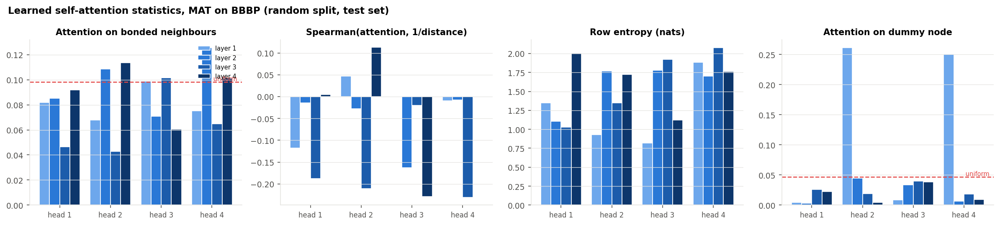

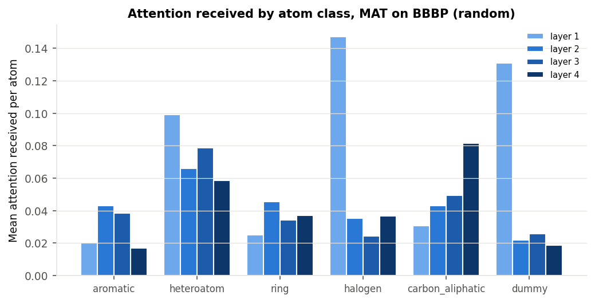

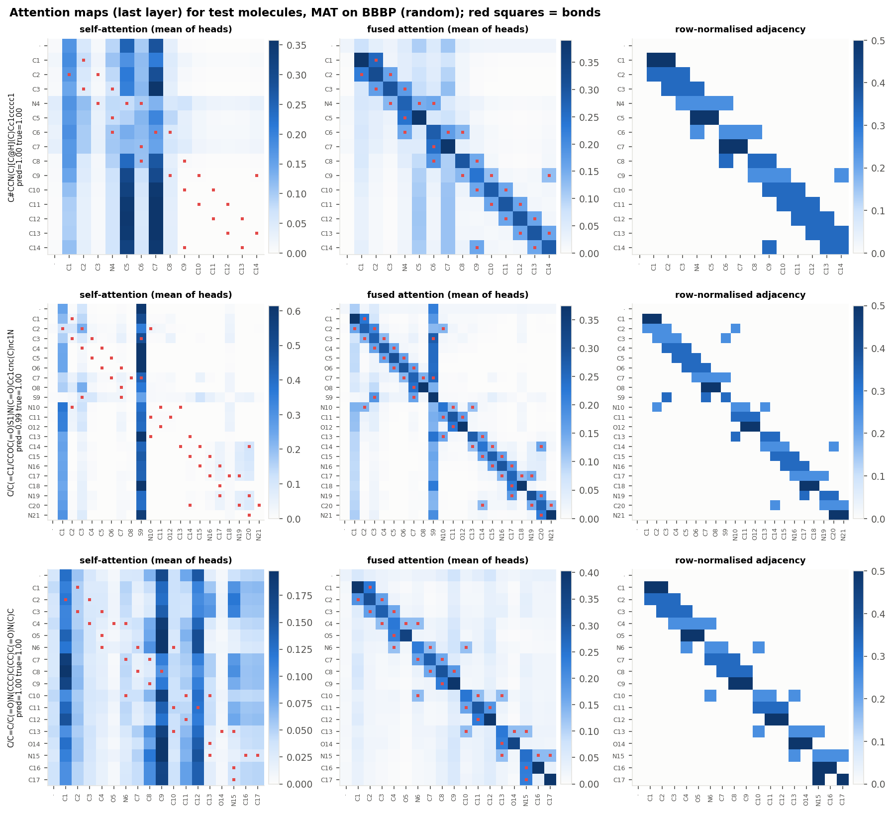

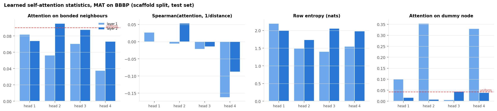

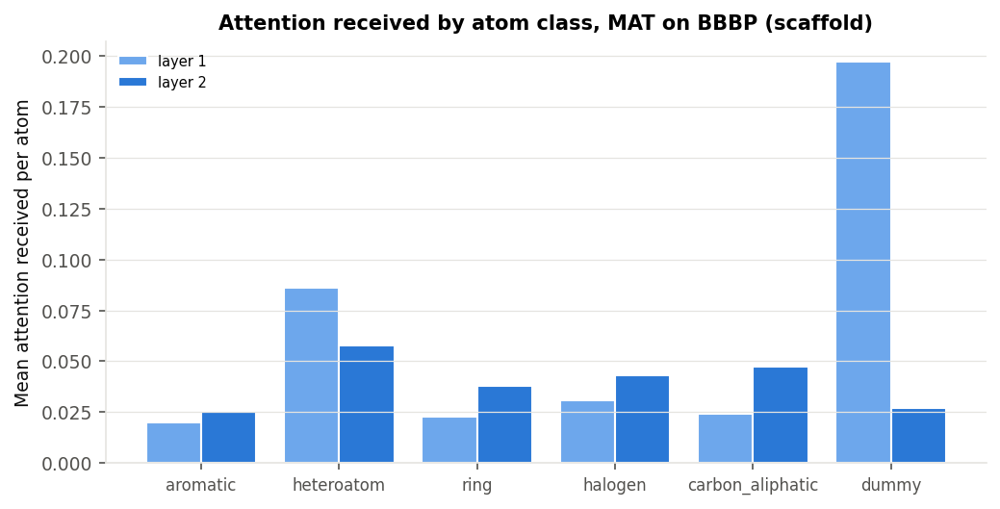

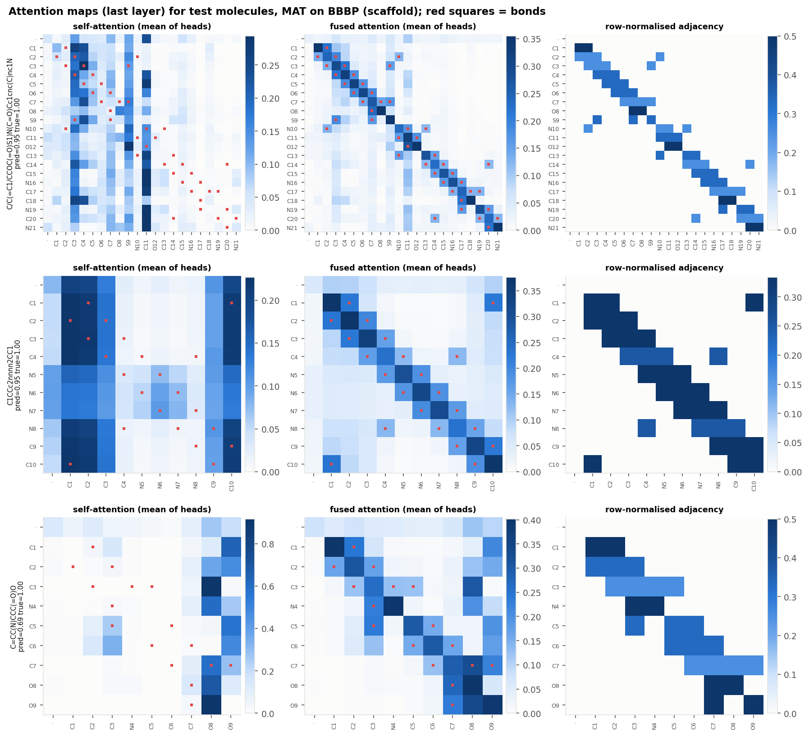

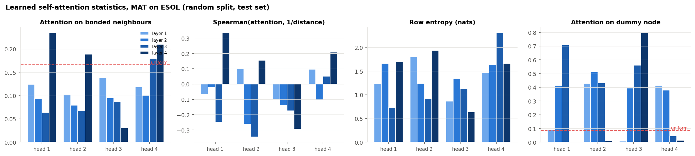

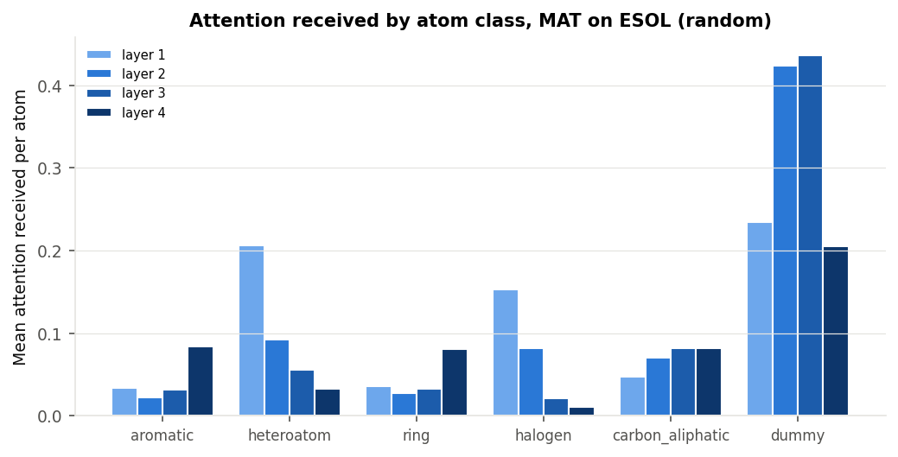

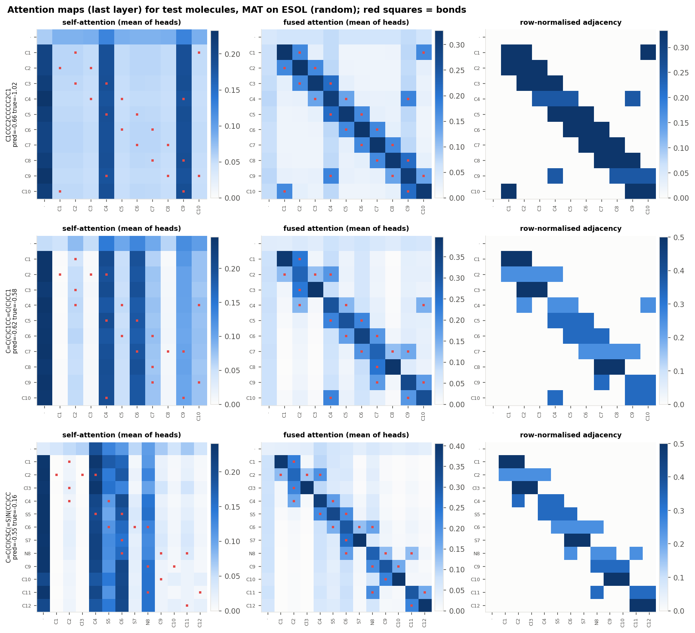

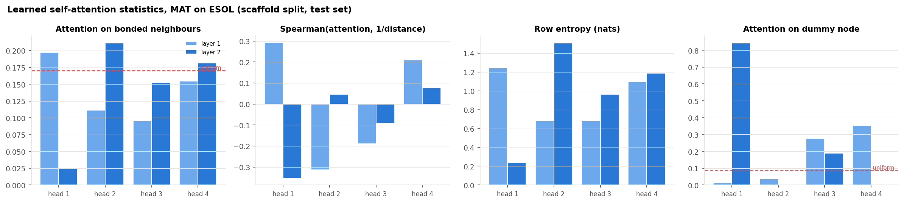

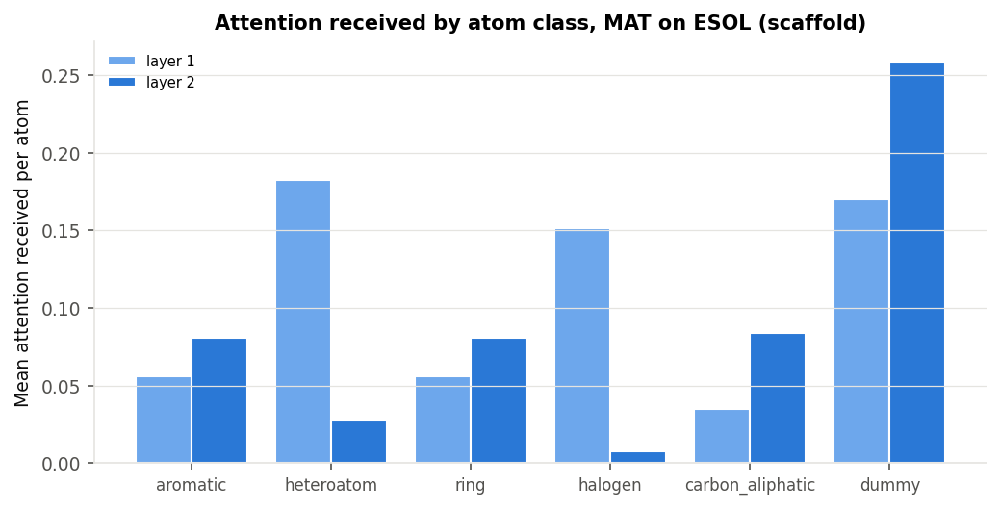

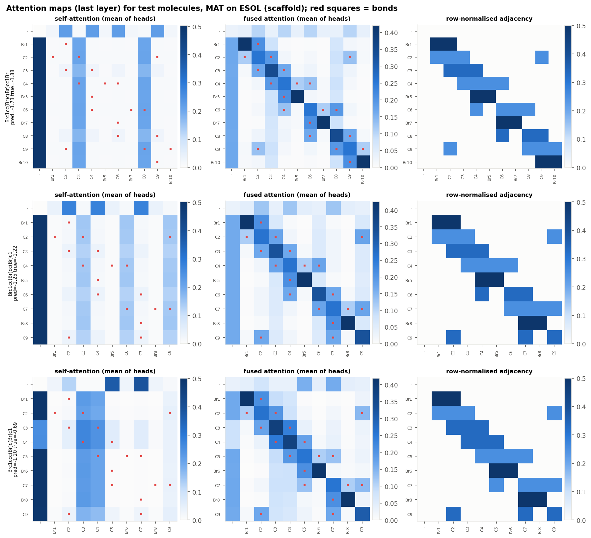

| Task | Split | Kind | Bonded share | Uniform bonded | Self share | Dummy share | Spearman(att, 1/d) | Entropy | Bonded share range over heads |
|---|---|---|---|---|---|---|---|---|---|
| BBBP | random | self_attn | 0.084 | 0.098 | 0.039 | 0.049 | -0.066 | 1.52 | 0.043 – 0.126 |
| BBBP | random | attn | 0.334 | 0.098 | 0.301 | 0.016 | 0.591 | 2.01 | 0.321 – 0.348 |
| BBBP | scaffold | self_attn | 0.072 | 0.090 | 0.044 | 0.112 | -0.026 | 1.80 | 0.038 – 0.095 |
| BBBP | scaffold | attn | 0.330 | 0.090 | 0.300 | 0.037 | 0.605 | 2.11 | 0.318 – 0.337 |
| ESOL | random | self_attn | 0.119 | 0.166 | 0.069 | 0.325 | -0.051 | 1.39 | 0.031 – 0.234 |
| ESOL | random | attn | 0.338 | 0.166 | 0.335 | 0.107 | 0.718 | 1.79 | 0.309 – 0.376 |
| ESOL | scaffold | self_attn | 0.141 | 0.170 | 0.082 | 0.214 | -0.040 | 0.95 | 0.024 – 0.211 |
| ESOL | scaffold | attn | 0.349 | 0.170 | 0.335 | 0.071 | 0.697 | 1.68 | 0.310 – 0.372 |

Mean self-attention received per atom by atom class (last layer):

| Task | Split | Atom class | Mean attention received |
|---|---|---|---|
| BBBP | random | aromatic | 0.0170 |
| BBBP | random | heteroatom | 0.0588 |
| BBBP | random | ring | 0.0370 |
| BBBP | random | halogen | 0.0368 |
| BBBP | random | carbon_aliphatic | 0.0816 |
| BBBP | random | dummy | 0.0188 |
| BBBP | scaffold | aromatic | 0.0255 |
| BBBP | scaffold | heteroatom | 0.0579 |
| BBBP | scaffold | ring | 0.0379 |
| BBBP | scaffold | halogen | 0.0432 |
| BBBP | scaffold | carbon_aliphatic | 0.0472 |
| BBBP | scaffold | dummy | 0.0269 |
| ESOL | random | aromatic | 0.0835 |
| ESOL | random | heteroatom | 0.0328 |
| ESOL | random | ring | 0.0809 |
| ESOL | random | halogen | 0.0104 |
| ESOL | random | carbon_aliphatic | 0.0815 |
| ESOL | random | dummy | 0.2054 |
| ESOL | scaffold | aromatic | 0.0807 |
| ESOL | scaffold | heteroatom | 0.0276 |
| ESOL | scaffold | ring | 0.0807 |
| ESOL | scaffold | halogen | 0.0074 |
| ESOL | scaffold | carbon_aliphatic | 0.0840 |
| ESOL | scaffold | dummy | 0.2587 |

## 10. Verdict on the central hypothesis

The hypothesis is that adding graph structure and 3D distances to self-attention improves accuracy and out-of-distribution generalization. The evidence is summarised from Sections 4 to 6 (numbers are computed, not interpreted, here; the discussion in `docs/PROJECT_OVERVIEW.md` interprets them):

- Removing **graph structure** (random split) hurts significantly on 5/7 tasks and helps significantly on 0/7 tasks.
- Removing **graph structure** (scaffold split) hurts significantly on 3/7 tasks and helps significantly on 0/7 tasks.
- Removing **3D distances** (random split) hurts significantly on 0/7 tasks and helps significantly on 0/7 tasks.
- Removing **3D distances** (scaffold split) hurts significantly on 0/7 tasks and helps significantly on 0/7 tasks.
- Removing **self-attention** (random split) hurts significantly on 7/7 tasks and helps significantly on 0/7 tasks.
- Removing **self-attention** (scaffold split) hurts significantly on 5/7 tasks and helps significantly on 0/7 tasks.
- RF (ECFP4) vs MAT (random): MAT significantly better on 2/7, RF (ECFP4) significantly better on 5/7.
- SVM/SVR (Tanimoto) vs MAT (random): MAT significantly better on 2/7, SVM/SVR (Tanimoto) significantly better on 5/7.
- GCN vs MAT (random): MAT significantly better on 1/7, GCN significantly better on 4/7.
- ECFP+MAT hybrid vs MAT (random): MAT significantly better on 1/7, ECFP+MAT hybrid significantly better on 5/7.
- RF (ECFP4) vs MAT (scaffold): MAT significantly better on 2/7, RF (ECFP4) significantly better on 5/7.
- SVM/SVR (Tanimoto) vs MAT (scaffold): MAT significantly better on 2/7, SVM/SVR (Tanimoto) significantly better on 5/7.
- GCN vs MAT (scaffold): MAT significantly better on 1/7, GCN significantly better on 3/7.
- ECFP+MAT hybrid vs MAT (scaffold): MAT significantly better on 1/7, ECFP+MAT hybrid significantly better on 4/7.

## 11. Limitations

- CPU-only execution: the small MAT configurations (d_model 64–128, 2–4 layers) are far smaller than the paper's tuned models; the pretrained-vs-scratch comparison uses a reduced protocol (fold 0 of each seed) and a short epoch budget.
- Scaffold K-fold: for ESOL and FreeSolv the benzene scaffold group is larger than one fold, so one scaffold test fold is identical across seeds; the seed-level tests are provided as the conservative check.
- Fold scores within a cross-validation are not independent (overlapping training sets), so paired-test p-values are somewhat optimistic; Holm-adjusted and seed-level p-values are reported alongside.
- ESOL/FreeSolv labels are z-scored in the released data; original-unit RMSE/MAE are recovered exactly through a linear map.

## 12. Reproducibility

- Tier 1: 2800 runs (2087 on cuda, 713 on cpu), 49.4 hours of model fitting summed over runs (executed in parallel on the laptop's 14 CPU workers and on Kaggle T4 GPUs; the `device` column of `results/raw/tier1_runs.csv` records where each run executed).
- Environment: Python 3.11.9 on Windows 11 (laptop, CPU) and the Kaggle Python image with CUDA (T4 GPUs); exact package versions used locally are pinned in `requirements.txt`; the `torch_version` column of the run CSVs records the GPU side.
- Re-run everything with `python run_all.py`; individual steps are the numbered scripts in `scripts/`.
